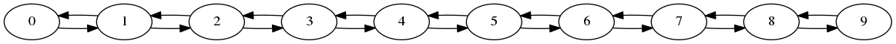

# visual-ll
Using graphviz to enable visualization on linked-list implementation.

# Author
* [Kevin Cyu](https://github.com/kevinbird61)

# Get Started
* Need to install dependencies
    * dependencies
```
sudo apt install graphviz
```
* Other Option - Current develop environment
    * `gcc`: v5.4.1
    * `GNU make`: v4.1
    * `gdb`: v7.11.1

# Run
* build
```
make
```

* run example and plot the visualization linked list
    * check out the result in `result/graph.png`
```
make plot
```

# Example
* Demo - visualizable linked-list
