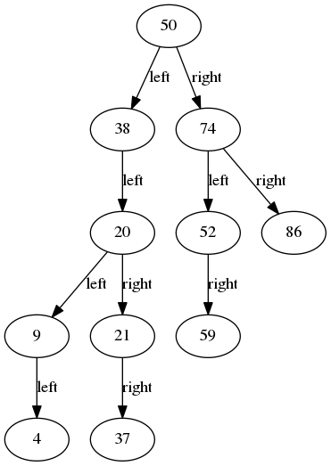

# visual-ll
Using graphviz to enable visualization on linked-list implementation.

# Author
* [Kevin Cyu](https://github.com/kevinbird61)

# Get Started
* Need to install dependencies
    * dependencies
```
sudo apt install graphviz
```
* Other Option - Current develop environment
    * `gcc`: v5.4.1
    * `GNU make`: v4.1
    * `gdb`: v7.11.1
* Memory error detector
    * `valgrind`: v3.11.0

# Run

## demo part
* run all demo (build + run + plot)
```sh
make
```
* run each 
```sh
# demo 1
make demo_r
# demo 2
make demo2_r
# demo 3
make demo3_r
```

## debug (by gdb)
* run each
```sh
# demo 1
make gdb1
# demo 2
make gdb2
# demo 3
make gdb3
```

## memory check (by valgrind)
* run each
```sh
# demo 1
make memcheck1
# demo 2
make memcheck2
# demo 3
make memcheck3
```

## clean all existed object files
```sh
make clean
```

# Example
* Demo - visualizable linked-list


* Demo - binary tree 



* Demo - directed graph

